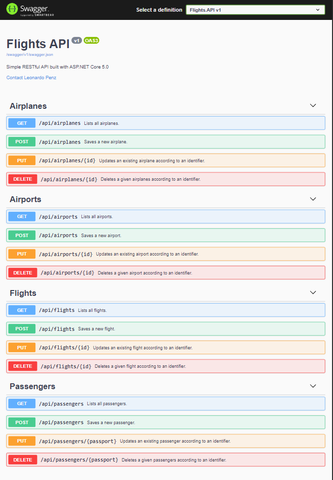

# flights-api
This project is a simple RESTful API developed with ASP.NET Core 5.0 with the goal of training the development of RESTful services using a maintainable and decoupled architecture.

## Frameworks and libraries
- [ASP.NET Core 5.0](https://docs.microsoft.com/en-us/aspnet/core/?view=aspnetcore-5.0);
- [Entity Framework Core](https://docs.microsoft.com/en-us/ef/core/) as a data persistence tool;
- [Entity Framework Core Design](https://www.nuget.org/packages/Microsoft.EntityFrameworkCore.Design/) to apply the code-first approach;
- [Entity Framework Core MySql](https://www.nuget.org/packages/Pomelo.EntityFrameworkCore.MySql/) as a MySQL database provider for Entity Framework;
- [Auto Mapper](https://automapper.org/) for mapping models;
- [Swashbuckle](https://github.com/domaindrivendev/Swashbuckle.WebApi) for API documentation;

## Usage
1. Configure your database connection on appsettings.json file;
2. Generate your database tables (code-first approach) using the following commands, in sequence:
```
dotnet ef migrations add migration_name
dotnet ef database update
```
3. Run application:
```
dotnet run
```
4. Test flights endpoint navigating to 'https://localhost:5001/api/flights'.
5. Check all endpoints navigating to 'https://localhost:5001/swagger/index.html'. The result should be as shown in the image below.


